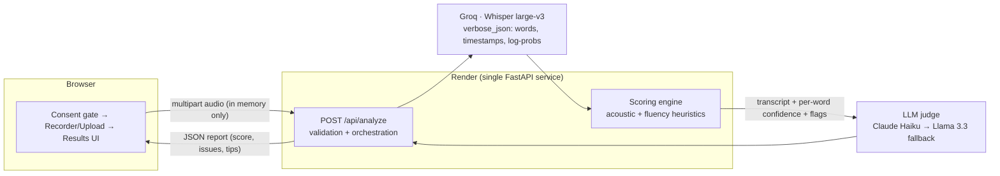

# PronounceCoach — System Architecture

## 1. Components

One deployable unit: FastAPI serves both the API and the static frontend. No
database, no object storage, no queue — deliberate, see §5.

**Request flow:** browser enforces consent and the 45s cap → server re-validates
(size cap, then the *decoded* duration from Whisper's response, so a renamed
10-minute file can't sneak past a client-side check) → STT → heuristic scoring →
LLM judge → merged JSON report → rendered client-side. Audio lives only in a
request-scoped buffer and is released immediately after transcription.

## 2. Models & APIs — and why

| Choice | Alternatives considered | Why this one |
|---|---|---|
| **Whisper large-v3 via Groq** | OpenAI Whisper API, Deepgram, AssemblyAI, self-hosted faster-whisper | Only `verbose_json` variants expose `avg_logprob`/`no_speech_prob`, which is the backbone of my acoustic signal. Groq serves it with very low latency on a free tier, so the demo has zero standing cost. Self-hosting was rejected: a 512 MB free dyno can't hold large-v3, and tiny models degrade exactly the signal I score on. |
| **Claude Haiku as judge** (env-gated) | GPT-4o-mini, Llama 3.3, no LLM at all | LLM converts raw evidence into feedback a learner can act on ("sounded like *sheep* — lengthen the /ɪ/") and catches text-level evidence of mispronunciation (wrong homophones, garbled tokens) that acoustics alone miss. Claude for judgment quality; Llama 3.3 on Groq as free fallback; pure-heuristic mode if neither key exists — the app never hard-fails on a provider outage. |
| **FastAPI + vanilla JS** | Next.js + separate API | One service = one deploy, no CORS, no build step; matches Livo's backend stack. The UI is a single page — React would be ceremony here. |
| **Render (free)** | Vercel, Fly.io, Railway | Long-running Python process suits a 5–15s pipeline better than serverless function limits; `render.yaml` gives reviewers a reproducible blueprint. |

## 3. Scoring & highlighting

**Acoustic layer (deterministic).** Whisper's decoder log-probability drops when
audio is ambiguous to the model — a strong proxy for unclear/mispronounced speech.
Per segment: `confidence = exp(avg_logprob) × (1 − 0.6·no_speech_prob)`, inherited
by each word via its timestamp. Words below 0.45 are flagged *unclear*, below 0.62
*attention*. Fluency comes from speaking rate vs. a 1.8–3.2 words/sec conversational
band and inter-word pauses > 1.2s (*hesitation* flags).

**Score:** `100 × (0.45·clarity + 0.30·accuracy + 0.25·fluency)` where clarity is
mean word confidence and accuracy is the fraction of words not hard-flagged.
Weights are judgment calls, not fitted — the goal is a stable, monotonic signal a
learner can improve against, not a calibrated CEFR grade.

**LLM layer.** The judge receives the numbered transcript with per-word confidence
and flags, and returns per-word verdicts + notes + tips as strict JSON. It can
refine a flag into a specific diagnosis, escalate text-level evidence the acoustics
missed, or clear soft false positives. Its score adjustment is clamped to ±10 so
acoustics stay authoritative and the LLM can't hallucinate the grade. **Highlight
rule:** a word is highlighted if either layer flags it; the LLM's note wins because
it's actionable.

## 4. DPDP Act 2023 compliance

Designed around **data minimisation**: the cheapest data to protect is data you
never keep.

- **Consent (§6):** a consent gate precedes any recording — free, specific,
  informed, and for a single stated purpose (pronunciation feedback). No
  pre-ticked boxes; the mic is not touched until consent. Withdrawal is trivial:
  close the tab and nothing about the user exists anywhere.
- **Storage & retention:** zero-retention by architecture, not by policy. Audio is
  held in a request-scoped memory buffer, never written to disk or any datastore,
  and explicitly released after transcription. Results are returned to the browser
  and live only in that tab. There is nothing to breach at rest.
- **Deletion (§12):** erasure requests are satisfied structurally — there is no
  stored personal data to erase. Server logs carry request metadata only
  (duration, score, latency), never audio, transcripts, or identifiers.
- **Data residency / cross-border transfer (§16):** audio transits to Groq (US)
  and optionally Anthropic (US) for processing under their API terms, which
  exclude retention for training. DPDP permits transfers except to blacklisted
  jurisdictions, so this is compliant today — but for an enterprise Indian client
  I would move STT and the judge to **AWS Bedrock in ap-south-1 (Mumbai)**
  (Whisper-class model + Claude) so voice data never leaves India. The provider
  abstraction in `stt.py`/`llm.py` makes that a config change, not a rewrite.
- **Data fiduciary duties:** privacy notice is on-page (what is collected, why,
  for how long, and a grievance contact); processors are limited to what the
  consented purpose requires; TLS in transit end-to-end.

## 5. Trade-offs & next week

**Deliberate trade-offs:** no reference-text mode — scoring is unscripted, which
means I can't do true phoneme-level comparison against a known target; Whisper
confidence is a proxy for pronunciation quality, so a heavy accent that Whisper
handles well scores higher than a purist might grade it (I treat "intelligibility
to a strong ASR" as the honest thing this system measures); no user accounts or
history, which is both a scope cut and the DPDP-simplest design; free-tier hosting
cold-starts (~30s) after idle.

**With another week:** (1) a *read-this-sentence* mode — align spoken phonemes
against the target text's G2P phonemes (CMUdict + forced alignment) for true
per-phoneme scoring like `/ɪ/ vs /iː/`; (2) progress tracking with opt-in,
consent-versioned storage (Supabase Postgres, Mumbai region) and per-user
deletion; (3) an eval set — 50 labelled clips (native / L2-clear / L2-unclear) to
regression-test score monotonicity whenever the pipeline changes; (4) Bedrock
migration for full data residency; (5) streaming partial results so feedback
appears as the pipeline runs.
